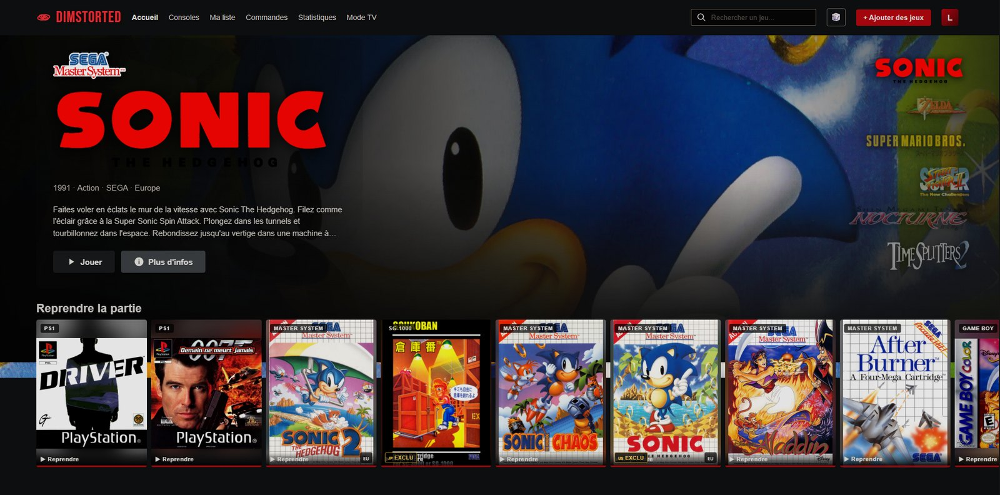
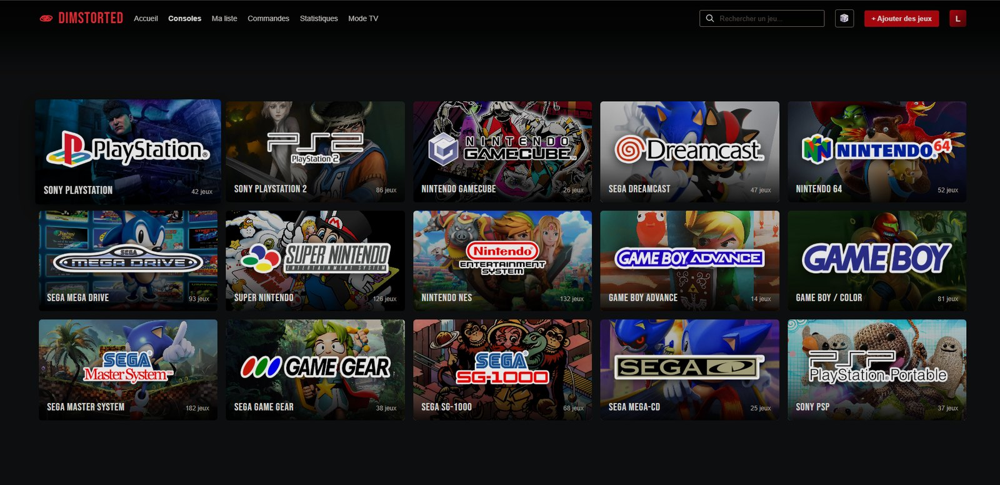
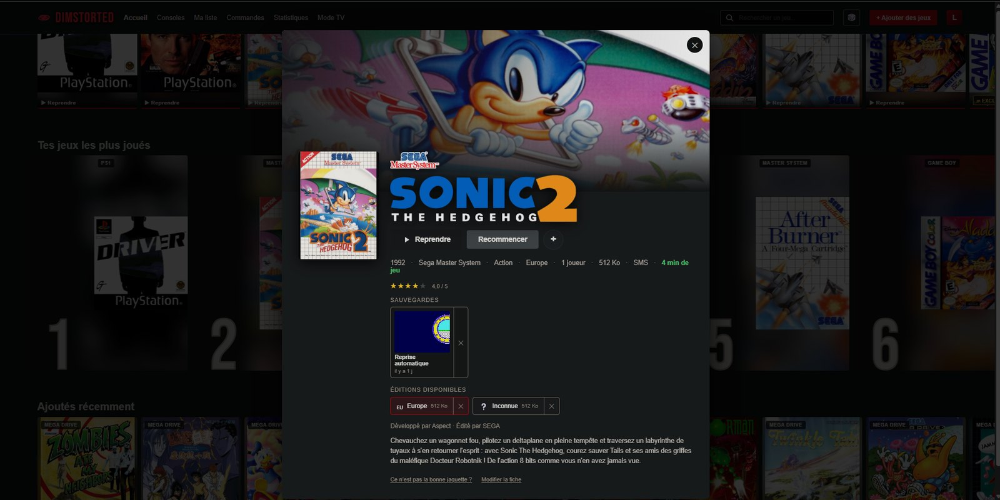
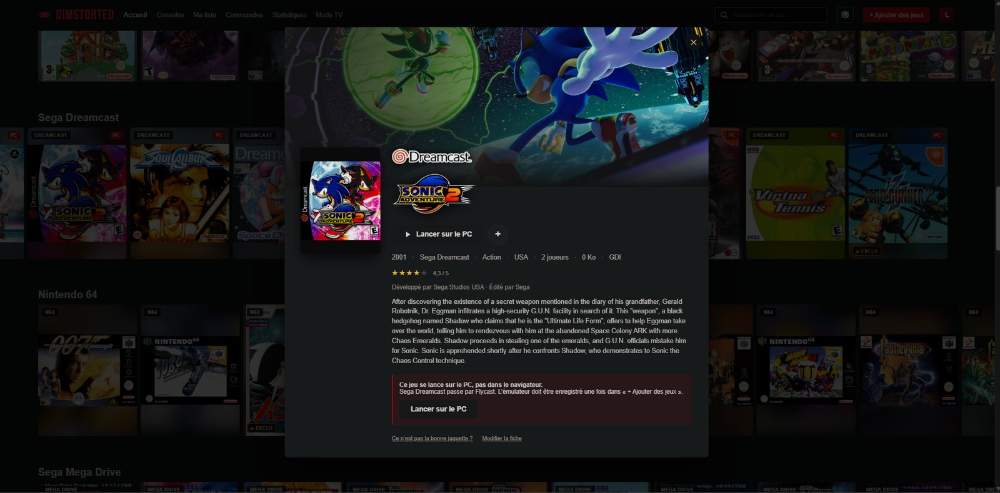
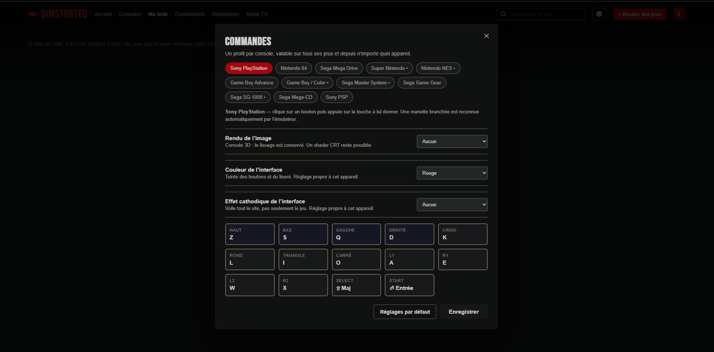

<h1 align="center">Dimstorted</h1>

<p align="center">
  Ma collection de jeux rétro, rangée comme un catalogue de streaming.<br>
  Quinze consoles, mille jeux, et rien qui sorte de la machine.
</p>

<p align="center">
  
  
  
  
  
  
</p>



Le serveur écoute sur `127.0.0.1`. Pas de compte, pas de service tiers, pas de
télémétrie. Le nom vient de *dimension tordue* — l'effet Lense-Thirring, quand
une masse en rotation entraîne l'espace-temps avec elle.

---

## Ce que ça fait

On dépose des fichiers dans un dossier. Dimstorted les identifie, les range,
va chercher leurs jaquettes et leurs synopsis, et les rend jouables — dans le
navigateur pour les douze consoles qu'EmulatorJS sait émuler, via PCSX2,
Dolphin ou Flycast pour les trois autres. Les fangames PC se lancent de la
même façon, après approbation explicite.

**Quinze consoles** : PlayStation, PlayStation 2, PSP, Dreamcast, GameCube,
Nintendo 64, Super Nintendo, NES, Game Boy / Color, Game Boy Advance,
Mega Drive, Mega-CD, Master System, Game Gear, SG-1000.



---

## L'identification des fichiers

C'est le cœur du projet, et la partie la moins évidente.

Un fichier de jeu ne dit pas de quelle console il vient. L'extension ment
souvent — les dumps TOSEC de Super Nintendo sortent en `.bin`, qui désigne
aussi bien une piste de CD qu'une cartouche Mega Drive. Le nom ne vaut pas
mieux : les packs écrivent « Final Fantasy 7 » là où les bases de données
disent « Final Fantasy VII ».

Dimstorted lit donc **l'en-tête binaire** :

| Console | Signature reconnue |
|---|---|
| Super Nintendo | somme de contrôle et son complément, dont le OU exclusif vaut `0xFFFF`, cherchés en `0x7FC0`, `0xFFC0` et `0x40FFC0`, avec ou sans en-tête de copieur |
| Mega Drive | `SEGA MEGA DRIVE` ou `SEGA GENESIS` en `0x100` |
| Dreamcast | `SEGA SEGAKATANA` dans la piste de données |
| Mega-CD | `SEGADISCSYSTEM` ou `SEGABOOTDISC` |
| PlayStation | `PLAYSTATION` dans les deux premiers mégaoctets |
| PlayStation 2 | `PLAYSTATION` **et** `BOOT2` |
| CHD | en-tête v5 lu directement — `logicalbytes`, `hunkbytes`, puis la liste chaînée de métadonnées `CHT2`/`CHTR` pour savoir si le disque est un CD ou un DVD |

Quand l'en-tête ne tranche pas, le dossier d'origine sert d'indice, et la
taille en dernier recours. Chaque décision est accompagnée de la raison qui
l'a produite, affichée dans la file d'attente avant validation.

Les images à feuille — `.cue`, `.gdi`, `.m3u` — sont suivies jusqu'à leurs
pistes, qui déménagent avec elles.

---

## La déduplication par empreinte

Deux fichiers portant des noms différents peuvent être le même jeu. Deux
fichiers portant le même nom peuvent être deux jeux différents.

Le second cas a coûté cher : **les 57 images Dreamcast nomment toutes leur
piste `track01.bin`**. Rangées à plat dans un dossier commun, cinquante-six
jeux sur cinquante-sept lisaient les données d'un voisin. Tous les contrôles
de présence passaient — les fichiers existaient, aux bons noms.

La correction tient en deux parties : chaque image à feuille reçoit son propre
sous-dossier, et [`scripts/verifier-pistes.js`](scripts/verifier-pistes.js)
compare l'**empreinte** de la piste de données de chaque jeu. Deux jeux ne
peuvent pas partager la même.

La détection de doublons suit le même principe : taille plus SHA-1 du premier
mégaoctet. Comparer les tailles seules ne suffit pas — sur des cartouches,
« Pokémon Red » et « Zool no Yume Bouken » font tous les deux exactement 1 Mo.

---

## Les métadonnées

Deux sources publiques, sans compte ni clé :

**[libretro-thumbnails](https://github.com/libretro-thumbnails)** pour les
jaquettes, les captures et les écrans-titres.

**[LaunchBox Games Database](https://gamesdb.launchbox-app.com/)** pour les
synopsis, les développeurs, les notes du public, et surtout deux images que
libretro ne publie pas : le **logo détouré** du jeu et son **illustration de
fond**. Ce sont elles qui donnent à l'interface son air d'affiche plutôt que
d'émulateur. Le dump fait 510 Mo de XML, lu en flux et réduit à un index local
de 27 Mo.

Le rapprochement des titres demande plus qu'une comparaison de chaînes. Les
chiffres romains sont convertis, les articles ignorés, les préfixes d'éditeur
retirés — et un **numéro de suite doit correspondre** : « Wario Land II » et
« Wario Land 3 » ne diffèrent que d'un caractère mais ce sont deux jeux.



---

## Le lancement natif

EmulatorJS n'a aucun cœur pour PS2, GameCube ni Dreamcast. Ces trois consoles
passent par un émulateur installé sur la machine, ce qui veut dire qu'un
serveur web lance un exécutable local. C'est traité comme tel :

- l'émulateur est **enregistré une fois**, et son SHA-256 est conservé ;
- l'empreinte est **revérifiée avant chaque lancement** — si le binaire a
  changé, le lancement est refusé ;
- `spawn` sans shell, jamais de chaîne concaténée ;
- la conversion de chemin WSL vers Windows ne s'applique qu'aux `.exe`.

Quatorze contrôles de bout en bout dans
[`scripts/smoke-launcher.js`](scripts/smoke-launcher.js), dont deux contre-épreuves :
la même commande passée à un shell y serait bien interprétée, ce qui prouve que
l'absence de shell est ce qui protège.



---

## Le reste

**Profils.** Plusieurs personnes, chacune avec ses sauvegardes, ses captures,
sa liste et son temps de jeu. Le profil actif est tenu côté serveur et recouvre
les champs concernés à la lecture, ce qui a évité de toucher aux trente routes
qui lisent un jeu.

**Sauvegardes d'état.** L'emplacement 0 est écrit à chaque sortie et alimente
la rangée « Reprendre la partie », avec la capture de la partie en vignette.
Neuf emplacements manuels par-dessus.

**Mode TV.** Navigation à la manette, barre d'aide en pied d'écran, horloge.
Chaque ligne de l'aide correspond à une action réellement branchée.

**Commandes par console**, injectées via `EJS_defaultControls` plutôt que
laissées au `localStorage` d'EmulatorJS, qui les garde par jeu.



---

## La pile

Rien d'exotique, et le moins de dépendances possible.

| | |
|---|---|
| **Serveur** | Node 20+, Express 4, modules ES natifs — 6 100 lignes |
| **Base** | SQLite via `better-sqlite3`, en mode WAL, migrations additives |
| **Interface** | JavaScript pur, **zéro dépendance front**, zéro étape de build — 6 000 lignes |
| **Émulation navigateur** | [EmulatorJS](https://emulatorjs.org/) — 12 cœurs, chargés depuis un CDN ou hébergés en local |
| **Émulation native** | PCSX2, Dolphin, Flycast, lancés par `spawn` sans shell |
| **Archives** | `yauzl` en flux, avec protection *zip slip* |
| **Dépôt de fichiers** | `multer` |
| **Tests** | Puppeteer — l'émulateur est réellement lancé, la partie sauvegardée, puis rechargée |

Quatre dépendances de production en tout. L'interface n'a ni React, ni bundler,
ni transpileur : le navigateur lit le fichier tel qu'il est écrit.

### Les scripts

```bash
npm start            # le serveur
npm run pistes       # verifie que chaque jeu lit bien ses propres pistes
npm run visuels      # recupere logos, illustrations et notes
npm run smoke        # lance un jeu dans un vrai navigateur et verifie le rendu
npm run offline      # heberge EmulatorJS en local plutot que depuis le CDN
```

---

## Installation

```bash
npm install
cp config.example.json config.json   # puis ajuster les chemins
npm start
```

Puis **http://127.0.0.1:1985**.

Node 20 ou plus. Les émulateurs navigateur sont chargés depuis un CDN par
défaut ; `scripts/vendor-emulatorjs.js` permet de les héberger en local.

Le [**manuel complet**](docs/MANUEL.md) couvre l'import, les BIOS, les
éditions régionales, les codes de triche, les fangames et la configuration.

---

## Usage

Dimstorted **range et présente des fichiers ; il n'en fournit aucun.** Le dépôt
ne contient ni jeu, ni BIOS, ni image de disque, et le projet n'en télécharge
pas : ce qu'on dépose dans le dossier d'import ne regarde que celui qui l'y
dépose, et relève de sa seule responsabilité.

Dans la plupart des pays, la copie d'un jeu sous droits est licite quand elle
est faite à partir de son propre exemplaire et reste dans le cercle privé. Se
procurer cette copie ailleurs ne l'est pas. Le code publié ici ne change rien
à cette distinction, et n'a pas vocation à la contourner.

Il a été écrit pour un usage personnel, sur une machine personnelle, avec une
collection personnelle.

---

## Ce que le dépôt ne contient pas

**Aucun jeu.** Ni ROM, ni BIOS, ni image de disque. Dimstorted est un
catalogueur : ce qu'on y dépose ne regarde que celui qui le dépose.

**Aucune donnée locale.** `data/` — la base, les jaquettes récupérées, les
sauvegardes de partie — est exclu. Les visuels viennent de libretro et de
LaunchBox et ne sont pas à nous.

**Les visuels du thème.** Les logos de consoles, leurs illustrations et les
textures d'effet cathodique proviennent d'un thème tiers (voir Crédits) publié
sans licence. Ils ne sont donc pas redistribués. **Sans eux l'interface
fonctionne** : les tuiles se rabattent sur un aplat aux couleurs de la machine
et son nom, et le sélecteur d'effet disparaît.

---

## Crédits

L'habillage s'inspire très largement d'
**[Alekfull-ARTFLIX](https://github.com/fagnerpc/Alekfull-ARTFLIX)** de
fagnerpc, un thème pour Batocera et RetroBat : la grille de tuiles, la colonne
de logos, la barre d'aide, le titre montré en lettrage plutôt qu'écrit. Le code
est original, mais l'idée vient de là et mérite d'être dite.

Métadonnées et visuels :
[libretro-thumbnails](https://github.com/libretro-thumbnails),
[libretro-database](https://github.com/libretro/libretro-database),
[LaunchBox Games Database](https://gamesdb.launchbox-app.com/).

Émulation navigateur : [EmulatorJS](https://emulatorjs.org/).

Les logos de consoles et les jaquettes appartiennent à leurs ayants droit
respectifs.
